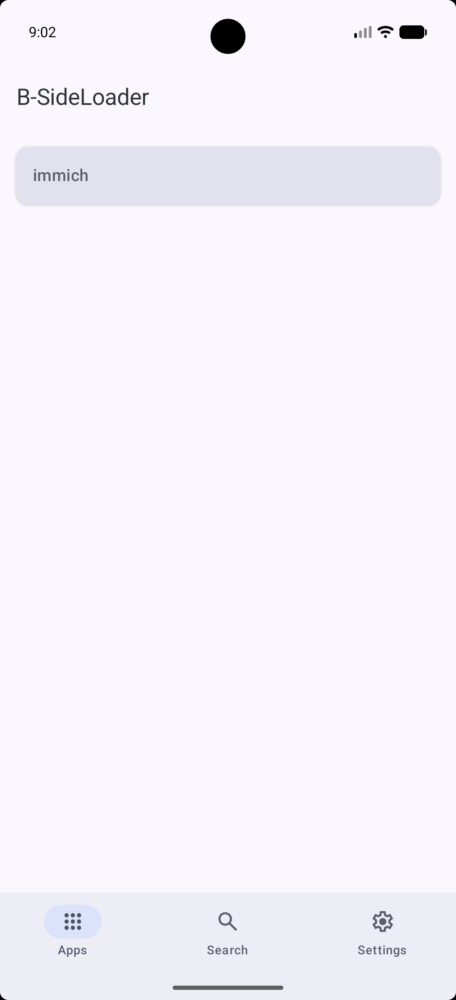
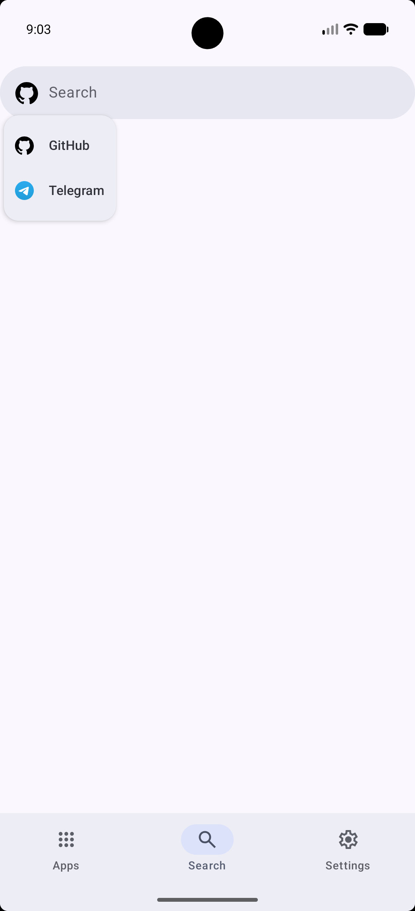
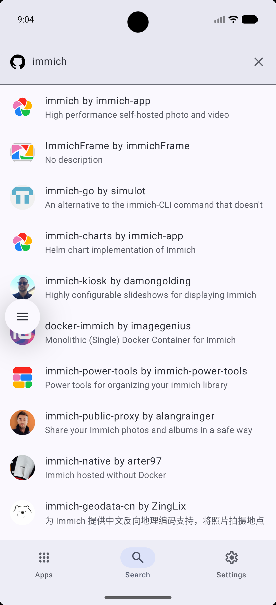
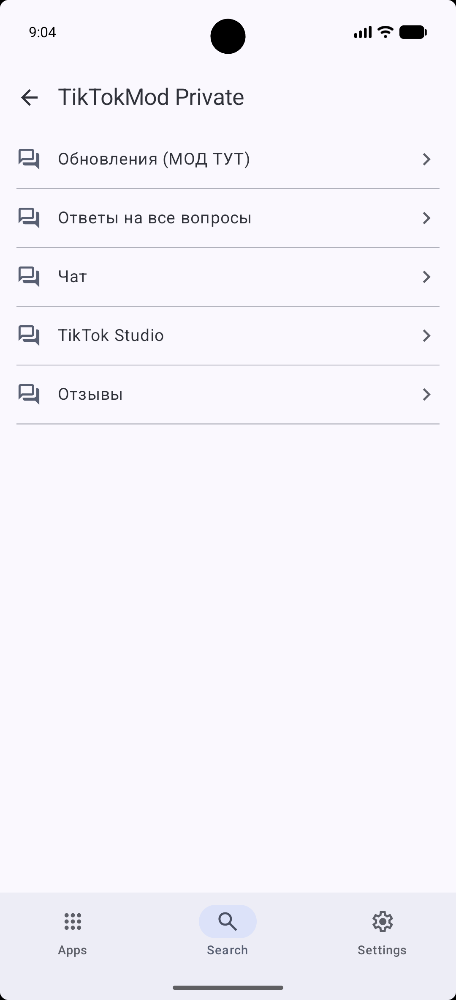
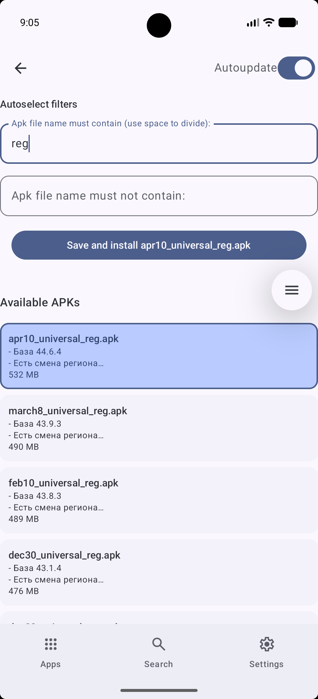
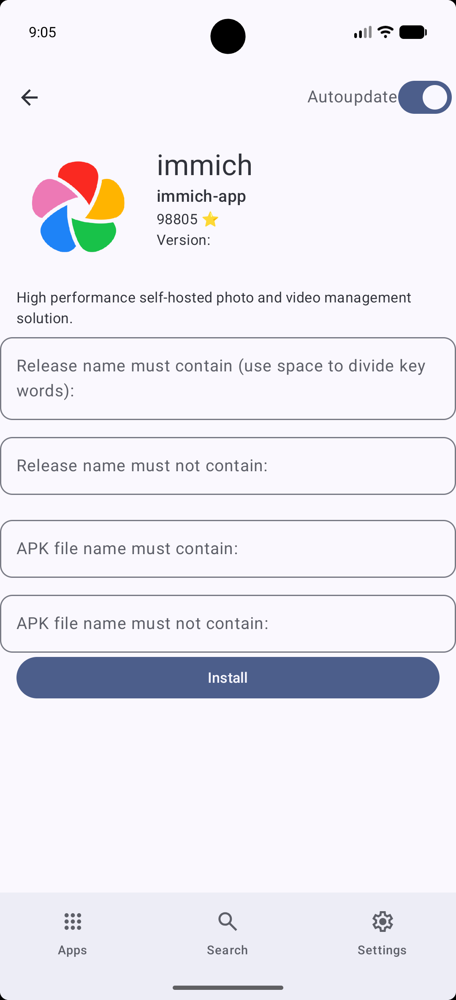
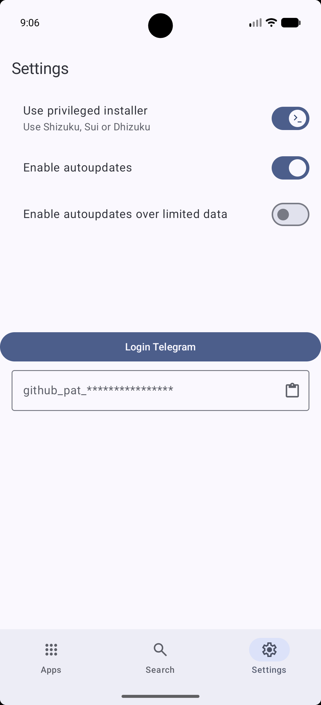

# B-SideLoader
Download, install and autoupdate your apps by grabbing APKs from the Internet! Basically [Obtainium](https://github.com/ImranR98/Obtainium), but made using Android Compose.
Compatible with Android 17-8.0.
## Features
- It has support for downloading and automatic updating APKs from GitHub repos and _Telegram channels_.
- It has integrated search for all sources.
- It can use special privileges for seamless installations (Shizuku (ADB or Root), Dhizuku, Sui).
- Also your private data is encrypted using AES-256 GCM key stored in android hardware key storage!
### Tech stack:
- Android Compose with Kotlin
- MVVM with a real domain layer — pure `domain` (models, use cases, source-selection logic) sitting between `ui` and `data`, with mappers at every boundary
- Jetpack Navigation 3 — the back stack is app state, one stack per top-level destination
- Hilt dependency injection (Based on Dagger)
- Room for apps database storage (schemas exported, migrations tested)
- Coil for loading images
- Retrofit 3.0 and OkHTTP for GitHub REST API, with auth/header interceptors and debug-only logging
- AndroidX Work Manager for background jobs, plus an opt-in foreground service for ROMs that kill them
- Datastore Preferences for storing app settings
- TDlib stripped from [TelegramX](https://github.com/TGX-Android/tdlib)
- And shizuku, dhizuku, refine and hiddenapibypass for getting special privileges

Development docs: [CLAUDE.md](CLAUDE.md) for the architecture, [docs/testing.md](docs/testing.md) for the test strategy.
### Currently in WIP state, because there are pending breaking changes in database.
If you want to compile by yourself, you must get your telegram api id and hash at https://my.telegram.org/apps. It's made to prevent abuse of dev's credentials.
Also, it's recommended to set idea.max.intellisense.filesize=5000 in idea.properties and invalidate caches for comfortable development.
#### Why B-side
_A B-side is a "flipside" song, originally referring to the secondary, often experimental or unpromoted track on the back of a physical 7-inch vinyl single._
_Sideloading is the installation of applications on a device from unofficial sources outside authorized app stores._
## Screenshots
|        |        |   |
| -------------------------------------------------------- | ---------------------------------------------------------- | -----------------------------------------------------------|
|  |  |  |
|    |
