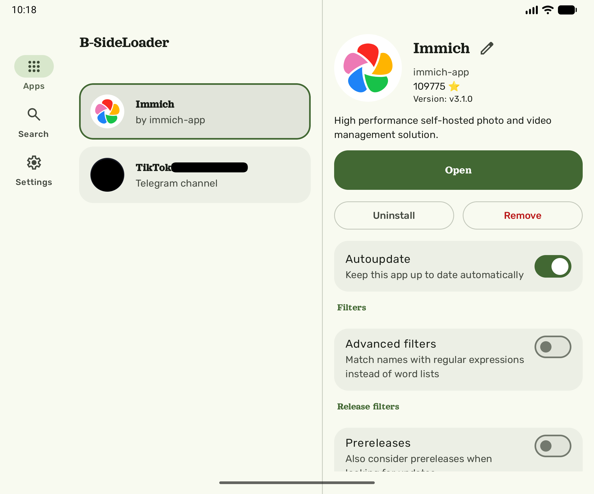

# B-SideLoader
Download, install and autoupdate your apps by grabbing APKs from the Internet!

## Features
- It has support for downloading and automatic updating APKs from GitHub repos and _Telegram channels_.
- It has integrated search for all sources.
- It can use special privileges for seamless installations (Shizuku (ADB or Root), Dhizuku, Sui, Foreground service, etc.).
- Your private data is encrypted
### Tech stack:
- Android Compose with Kotlin
- MVVM
- Jetpack Navigation 3
- Hilt dependency injection
- Room for apps database storage
- Coil for loading images
- Retrofit 3.0 and OkHTTP for GitHub REST API
- AndroidX Work Manager + Foreground service for background jobs
- Datastore Preferences for storing app settings
- TDlib stripped from [TelegramX](https://github.com/TGX-Android/tdlib)
- And shizuku, dhizuku, refine and hiddenapibypass for getting special privileges
### Notes for developers
If you want to compile by yourself, you must get your telegram api id and hash at https://my.telegram.org/apps. It's made to prevent abuse of dev's credentials.
Also, it's recommended to set idea.max.intellisense.filesize=5000 in idea.properties and invalidate caches for comfortable development.
#### Why B-side
_A B-side is a "flipside" song, originally referring to the secondary, often experimental or unpromoted track on the back of a physical 7-inch vinyl single._
_Sideloading is the installation of applications on a device from unofficial sources outside authorized app stores._
