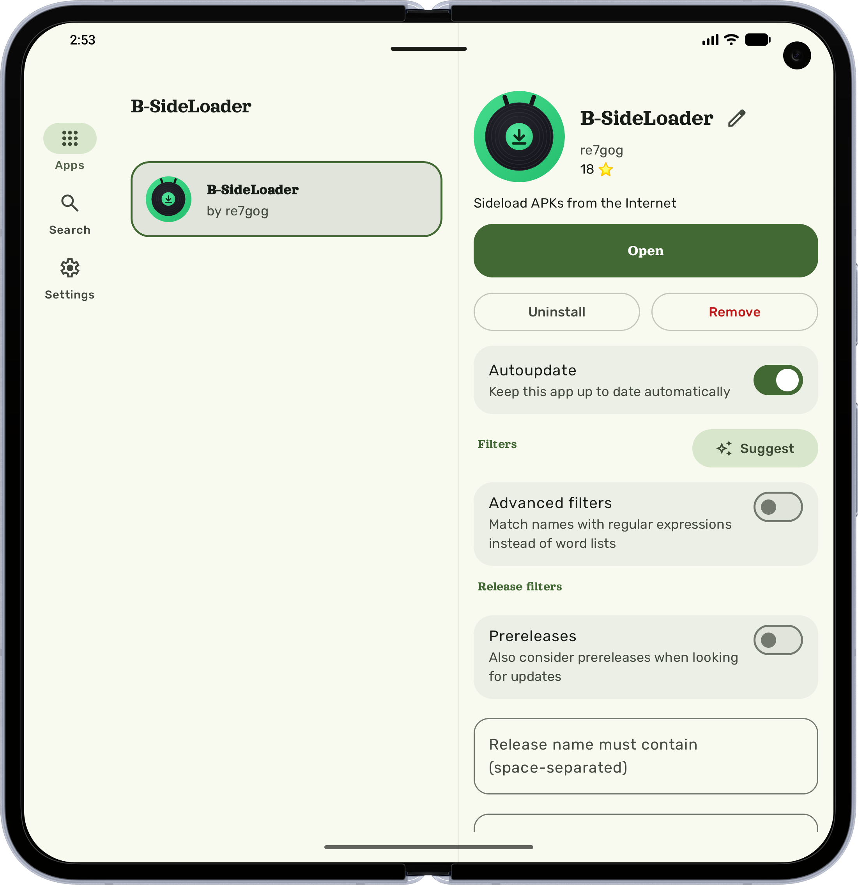

<div align="center">

# B-SideLoader

**Find, install and auto-update Android apps straight from GitHub releases and Telegram channels.**

[](https://github.com/re7gog/B-SideLoader/releases/latest)
[](https://github.com/re7gog/B-SideLoader/actions/workflows/android.yml)
[](#install)
[](LICENSE)



</div>

## Features

### Sources
- **GitHub releases.** Track any repository, with or without pre-releases.
- **Telegram channels.** Sign in to Telegram once and track APKs posted in a channel or in one topic
  of a forum group. A multi-file album counts as one version.
- **Search across sources.** Find a repository or channel from inside the app.
- **Local APKs.** Install a file you already have.

### Picking the right file
- **The right APK for your device.** When a release ships one APK per architecture
  (`arm64-v8a`, `armeabi-v7a`, `x86_64`, `x86`), B-SideLoader picks one that runs on your phone.
- **Filters.** Include/exclude rules for release names, Telegram messages and file names, as plain
  words or as regular expressions.
- **Preview before you save.** The app page lists recent releases and highlights the exact file an
  update would install.
- **Filter suggestions (optional AI).** Pick an example file or describe what you want, and the app
  proposes filters. A suggestion based on an example file needs no AI. A description goes to Gemini
  Nano on your device or to a cloud model with your own API key (OpenAI, Anthropic or Gemini). Every
  suggestion is checked against the real releases before you see it. The AI only suggests filters:
  you decide whether to apply them, and it never decides what gets installed.

### Installing and updating
- **Standard installer, or silent installs with privileges:**
  [Shizuku](https://github.com/RikkaApps/Shizuku) (ADB or root),
  [Sui](https://github.com/RikkaApps/Sui) or
  [Dhizuku](https://github.com/iamr0s/Dhizuku).
- **Silent updates without any extra apps** on Android 12+, for apps B-SideLoader installed itself.
  On Android 14+, the app asks you to approve an install while the download is still running.
- **Background updates.** A battery-friendly periodic check, or an always-on service for phones that
  stop background jobs. You can choose the check interval and whether to use mobile data, and
  download several apps at once. Turn off auto-update for an app and you only get notified.
- **Notifications** for anything that needs you to confirm it. Tap one to install everything that
  is waiting.
- **Background reliability checklist.** On Xiaomi/HyperOS, Huawei, OPPO/ColorOS, vivo, Meizu and
  other ROMs, the app shows the steps your phone needs and opens the right system screen.
- **Updates itself** from this repository's releases, like any other app it tracks.

### Privacy and looks
- Your Telegram session key, GitHub token and AI API keys are encrypted with a hardware-backed
  Android Keystore key.
- No analytics or tracking. The app only connects to GitHub, Telegram and the AI provider you picked.
- Material 3 design with light, dark and dynamic colour themes.
- Available in English and Russian.

## Install

1. Download an APK from the [latest release](https://github.com/re7gog/B-SideLoader/releases/latest).
   Take the one for your architecture (almost every modern phone is `app-arm64-v8a-release.apk`), or
   `app-universal-release.apk` if you're not sure.
2. Open it and allow installs from this source when asked.
3. Optional: in Settings, sign in to Telegram, add a GitHub token (to avoid GitHub's limit on
   unauthenticated requests), choose an installer and set up background updates.

After that, B-SideLoader keeps itself up to date.

### Verifying a download

Every release APK is built by [GitHub Actions](.github/workflows/android.yml) and comes with a
signed [build provenance attestation](https://docs.github.com/en/actions/how-tos/secure-your-work/use-artifact-attestations/use-artifact-attestations).
To check that an APK was built from this repository by that workflow and not modified, run:

```bash
gh attestation verify app-arm64-v8a-release.apk -R re7gog/B-SideLoader
```

## Building from source

You need JDK 25 and the Android SDK (`compileSdk` 37).

1. Get a Telegram API id and hash at <https://my.telegram.org/apps>. The source doesn't include
   the developer's own, to prevent abuse.
2. Add them to `local.properties` as `ID_SECRET`, `MASK_SECRET` and `HASH_SECRET`. They are
   obfuscated into a native library at build time.
3. Build:

   ```bash
   ./gradlew assembleDebug
   ```

| Command | What it does |
|---|---|
| `./gradlew assembleDebug` | Debug APKs, one per ABI plus a universal one |
| `./gradlew :app:assembleDev` | A release build installed next to the published app (`.dev` package, amber icon) |
| `./gradlew :app:testDebugUnitTest` | Every test: plain JVM and Robolectric, no device needed |
| `./gradlew lint` | All checks on, every warning fatal |

Tip: `TdApi.java` is about 4.8 MB, so set `idea.max.intellisense.filesize=5000` in
`idea.properties` for the IDE to index it.

[CLAUDE.md](CLAUDE.md) describes the architecture and the main flows, and
[docs/testing.md](docs/testing.md) describes the test suite.

## Tech stack

- **Kotlin** and **Jetpack Compose** (Material 3), **Navigation 3**
- **Clean-ish architecture:** `ui` → `domain` ← `data`, MVVM, **Hilt**
- **Room** for tracked apps, **DataStore** for settings
- **Retrofit 3** + **OkHttp 5** for the GitHub API, **Coil 3** for images
- **TDLib**, the native Telegram library, taken from [Telegram X](https://github.com/TGX-Android/tdlib)
- **WorkManager** and a foreground service for background updates
- **Shizuku**, **Dhizuku**, **refine** and **HiddenApiBypass** for privileged installs
- **ML Kit GenAI Prompt API** (Gemini Nano), plus plain HTTPS calls to cloud models
- **Robolectric**, Compose UI tests and Slack's Compose lint rules

## Why "B-side"?

> A *B-side* is the flip side of a vinyl single: the secondary, often experimental track that
> wasn't promoted.
>
> *Sideloading* is installing apps from outside the official app stores.

## License

[GNU GPL v3](LICENSE)
